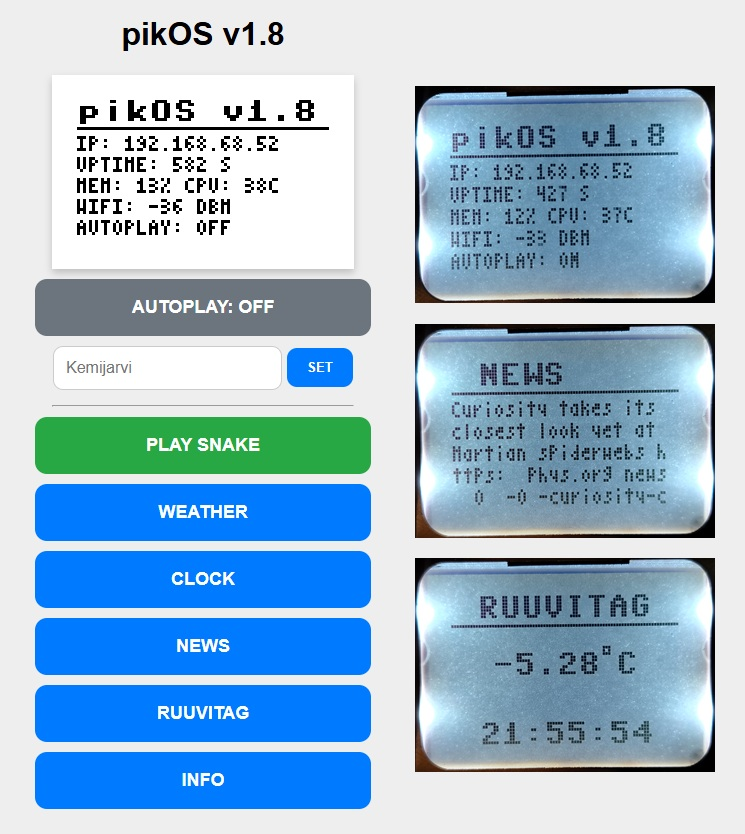

# pikOS v1.8 for Raspberry Pi Pico 2W

**pikOS** is a lightweight, modular "operating system" designed for the **Raspberry Pi Pico 2W** and the classic **Nokia 5110 (PCD8544)** LCD. It transforms your Pico into an interactive information display with a mobile-friendly Web UI for remote control.



## ✨ Features

- **Custom 3x5 Tiny Font**: High information density allowing up to 6 lines of text on a 84x48 display.
- **Autoplay Mode**: Automatically cycles through apps (Weather, Clock, News) with configurable timers.
- **Dynamic Weather**: Real-time data from OpenWeatherMap with automatic IP-based location discovery.
- **Yle News**: Latest headlines fetched directly from Yle (Finnish Broadcasting Company) Teletext API.
- **Snake Game**: A fully playable Snake game controlled via your tablet/phone browser.
- **Web Control Panel**: A modern, light-themed web interface to change cities, control the game, and toggle system settings.

## 🛠 Hardware Connection (Pinout)

[Technical Wiring Guide & Pinout](https://www.pavelp.cz/posts/eng-raspberry-pico-nokia-display/)

## 🚀 Installation

1. Install **MicroPython** on your Raspberry Pi Pico 2W.
2. Install these packages to your Raspberry Pi Pico 2W: **microdot**, **micropython-pcd8544**
3. Download all `.py` files from this repository.
4. Open `main.py` and update your Wi-Fi credentials:
   ```python
   WIFI_SSID = "your_wifi_name"
   WIFI_PASS = "your_password"
   ```
5. Open weather_app.py and add your OpenWeatherMap API key. You can get a free key from the OpenWeatherMap Portal.
6. Open news_app.py and add your Yle API app_id and app_key. Register for free keys at the Yle Developers Portal.
